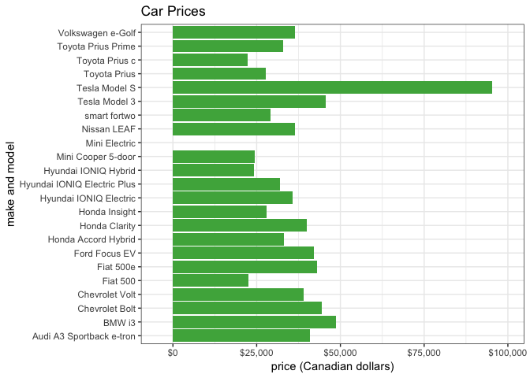
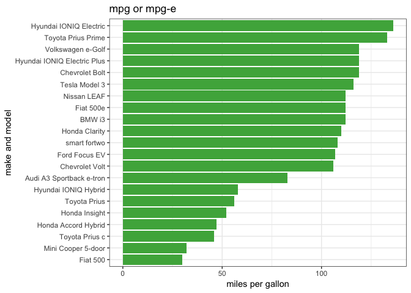

A Data Science Approach to Buying a Car
================

``` r
# load the data
vehicles <- suppressMessages(read_csv("data/Rachel_vehicles2.csv"))
scores <- suppressMessages(read_csv("data/scores.csv"))
scores2 <- suppressMessages(read_csv("data/scores2.csv"))
```

``` r
# rename variables so they are easier to work with (no spaces)
vehicles <- vehicles %>% 
  rename(make_model = "make model",
         purchase_price_CAD = "purchase price CAD",
         engine_type = "engine type",
         range_km = "range km",
         mpg_or_mpge_equivalent = "mpg or mpg-e equivalent",
         vehicle_class = "vehicle class",
         BC_incentives = "BC incentives")

scores <- scores %>% 
  rename(make_model = "make model",
         price_score = "price score",
         mpg_score = "mpg score",
         range_score = "range score",
         size_score = "size score",
         aesthetic_score = "aesthetic score")

scores2 <- scores2 %>% 
  rename(make_model = "make model",
         price_score = "price score",
         mpg_score = "mpg score",
         range_score = "range score",
         size_score = "size score",
         aesthetic_score = "aesthetic score")
```

### plot the vehicle prices

``` r
vehicles %>% 
  ggplot(aes(x = make_model, y = purchase_price_CAD)) +
  geom_bar(stat = "identity", fill="#4daf4a") +
  coord_flip() +
  scale_y_continuous(expand = c(.1, 0), labels = scales::dollar) +
  ggtitle("Car Prices") +
  labs(x = "make and model",
       y = "price (Canadian dollars)") +
  theme_bw()
```

<!-- -->

### compute new prices after taking incentives into consideration

``` r
# get rid of mini electric and tesla s
vehicles_drop <- vehicles %>% 
  filter(make_model != "Mini Electric" & make_model != "Tesla Model S")

# calculate price after incentives and reorder columns
vehicles_incentives <- vehicles_drop %>%
  mutate(price_after_incentives = purchase_price_CAD - BC_incentives) %>% 
  select(make_model, purchase_price_CAD, price_after_incentives, everything())
```

### plot the vehicle prices after incentives

``` r
vehicles_incentives %>% 
  ggplot(aes(x = reorder(make_model, desc(purchase_price_CAD)), 
             y = purchase_price_CAD)) +
  geom_bar(stat = "identity", fill="#4daf4a") +
  coord_flip() +
  scale_y_continuous(expand = c(.075, 0), labels = scales::dollar) +
  ggtitle("Prices After Incentives") +
  labs(x = "make and model",
       y = "price (Canadian dollars)") +
  theme_bw()
```

<!-- -->

### plot mpg

``` r
vehicles_incentives %>% 
  ggplot(aes(x = reorder(make_model, mpg_or_mpge_equivalent), 
             y = mpg_or_mpge_equivalent)) +
  geom_bar(stat = "identity", fill="#4daf4a") +
  coord_flip() +
  ggtitle("mpg or mpg-e") +
  labs(x = "make and model",
       y = "miles per gallon") +
  theme_bw()
```

<!-- -->

### plot range

``` r
# convert km to miles and reorder columns
vehicles_range <- vehicles_incentives %>% 
  mutate(range_miles = round((range_km * 0.621371), 0) ) %>% 
  select(make_model, purchase_price_CAD, price_after_incentives, range_km, 
         range_miles, everything())

# remove NAs
vehicles_range %>% 
  filter(!is.na(range_miles)) %>% 
  ggplot(aes(x = reorder(make_model, range_miles), y = range_miles)) +
  geom_bar(stat = "identity", fill="#4daf4a") +
  coord_flip() +
  ggtitle("Range on One Charge or One Tank of Gas") +
  labs(x = "make and model",
       y = "range (miles)") +
  theme_bw()
```

<!-- -->

### tables

for size and overall aesthetic scores

``` r
length(unique(vehicles$vehicle_class))
```

    ## [1] 8

``` r
unique(vehicles$vehicle_class) %>% knitr::kable()
```

| x                   |
| :------------------ |
| compact             |
| subcompact          |
| small station wagon |
| city car            |
| mid-size            |
| supermini           |
| two-seater          |
| full-size           |

``` r
# join vehicles and scores
joined_data <- left_join(scores2, vehicles, by = "make_model")

# size scores
joined_data %>% 
  select(make_model, vehicle_class, size_score) %>% 
  arrange(size_score) %>% 
  knitr::kable()
```

| make\_model                 | vehicle\_class      | size\_score |
| :-------------------------- | :------------------ | ----------: |
| Audi A3 Sportback e-tron    | compact             |           1 |
| BMW i3                      | subcompact          |           1 |
| Chevrolet Volt              | compact             |           1 |
| Fiat 500e                   | city car            |           1 |
| Fiat 500                    | city car            |           1 |
| Ford Focus EV               | compact             |           1 |
| Honda Accord Hybrid         | compact             |           1 |
| Mini Cooper 5-door          | supermini           |           1 |
| Toyota Prius                | compact             |           1 |
| Toyota Prius c              | subcompact          |           1 |
| Toyota Prius Prime          | compact             |           1 |
| Volkswagen e-Golf           | compact             |           1 |
| Honda Clarity               | mid-size            |           5 |
| Honda Insight               | mid-size            |           5 |
| Hyundai IONIQ Electric      | mid-size            |           5 |
| Hyundai IONIQ Electric Plus | mid-size            |           5 |
| Hyundai IONIQ Hybrid        | mid-size            |           5 |
| Nissan LEAF                 | mid-size            |           5 |
| Tesla Model 3               | mid-size            |           5 |
| smart fortwo                | two-seater          |           6 |
| Chevrolet Bolt              | small station wagon |           7 |

``` r
# aesthetic scores
scores2 %>% 
  select(make_model, aesthetic_score) %>% 
  arrange(aesthetic_score) %>% 
  knitr::kable()
```

| make\_model                 | aesthetic\_score |
| :-------------------------- | ---------------: |
| Fiat 500e                   |                1 |
| Fiat 500                    |                1 |
| Mini Cooper 5-door          |                1 |
| BMW i3                      |                4 |
| Toyota Prius                |                5 |
| Toyota Prius c              |                5 |
| Toyota Prius Prime          |                5 |
| Nissan LEAF                 |                8 |
| Chevrolet Bolt              |                9 |
| Chevrolet Volt              |               10 |
| Hyundai IONIQ Electric      |               10 |
| Hyundai IONIQ Electric Plus |               10 |
| Hyundai IONIQ Hybrid        |               10 |
| Honda Accord Hybrid         |               14 |
| Honda Insight               |               14 |
| Ford Focus EV               |               16 |
| Honda Clarity               |               16 |
| smart fortwo                |               16 |
| Tesla Model 3               |               16 |
| Audi A3 Sportback e-tron    |               20 |
| Volkswagen e-Golf           |               21 |

### plot final scores

``` r
# # calculate final scores
# scores_final <- scores %>% 
#   mutate(final_score = (price_score + (2 * mpg_score) + range_score + size_score + aesthetic_score) / 5)
# 
# scores_final %>% 
#   ggplot(aes(x = reorder(make_model, -final_score), y = final_score)) +
#   geom_bar(stat = "identity", fill="#4daf4a") +
#   coord_flip() +
#   ggtitle("Vehicles Ranked with Final Scores") +
#   labs(x = "make and model",
#        y = "score") +
#   theme_bw()
```

## using modified scores

``` r
# calculate final scores
scores_final <- scores2 %>% 
  mutate(final_score = (price_score + (2 * mpg_score) + range_score + size_score + aesthetic_score) / 5)

scores_final %>% 
  ggplot(aes(x = reorder(make_model, -final_score), y = final_score)) +
  geom_bar(stat = "identity", fill="#4daf4a") +
  coord_flip() +
  ggtitle("Vehicles Ranked with Final Scores") +
  labs(x = "make and model",
       y = "score") +
  theme_bw()
```

<!-- -->

``` r
scores_final %>% select(make_model, final_score) %>% arrange(final_score) %>% knitr::kable()
```

| make\_model                 | final\_score |
| :-------------------------- | -----------: |
| Toyota Prius Prime          |          4.0 |
| Hyundai IONIQ Electric Plus |          6.8 |
| Hyundai IONIQ Electric      |          8.4 |
| Toyota Prius                |          9.8 |
| Hyundai IONIQ Hybrid        |         10.2 |
| Nissan LEAF                 |         10.4 |
| Toyota Prius c              |         10.4 |
| Volkswagen e-Golf           |         10.6 |
| Chevrolet Bolt              |         11.2 |
| Fiat 500e                   |         11.4 |
| Chevrolet Volt              |         11.8 |
| BMW i3                      |         12.0 |
| Tesla Model 3               |         12.6 |
| smart fortwo                |         13.0 |
| Honda Clarity               |         13.2 |
| Honda Insight               |         13.2 |
| Fiat 500                    |         13.3 |
| Mini Cooper 5-door          |         13.5 |
| Honda Accord Hybrid         |         13.6 |
| Ford Focus EV               |         14.8 |
| Audi A3 Sportback e-tron    |         15.0 |

``` r
prius_score <- scores_final %>% filter(make_model == "Toyota Prius Prime") %>% select(final_score)

prius <- joined_data %>% 
  filter(make_model == "Toyota Prius Prime") %>% 
  select(make_model, vehicle_class, mpg_or_mpge_equivalent, purchase_price_CAD, BC_incentives) %>% 
  mutate(price_after_incentives = purchase_price_CAD - BC_incentives) %>% 
  select(-c(purchase_price_CAD, BC_incentives))

prius$final_score <- prius_score$final_score

prius %>% knitr::kable()
```

| make\_model        | vehicle\_class | mpg\_or\_mpge\_equivalent | price\_after\_incentives | final\_score |
| :----------------- | :------------- | ------------------------: | -----------------------: | -----------: |
| Toyota Prius Prime | compact        |                       133 |                    30490 |            4 |
